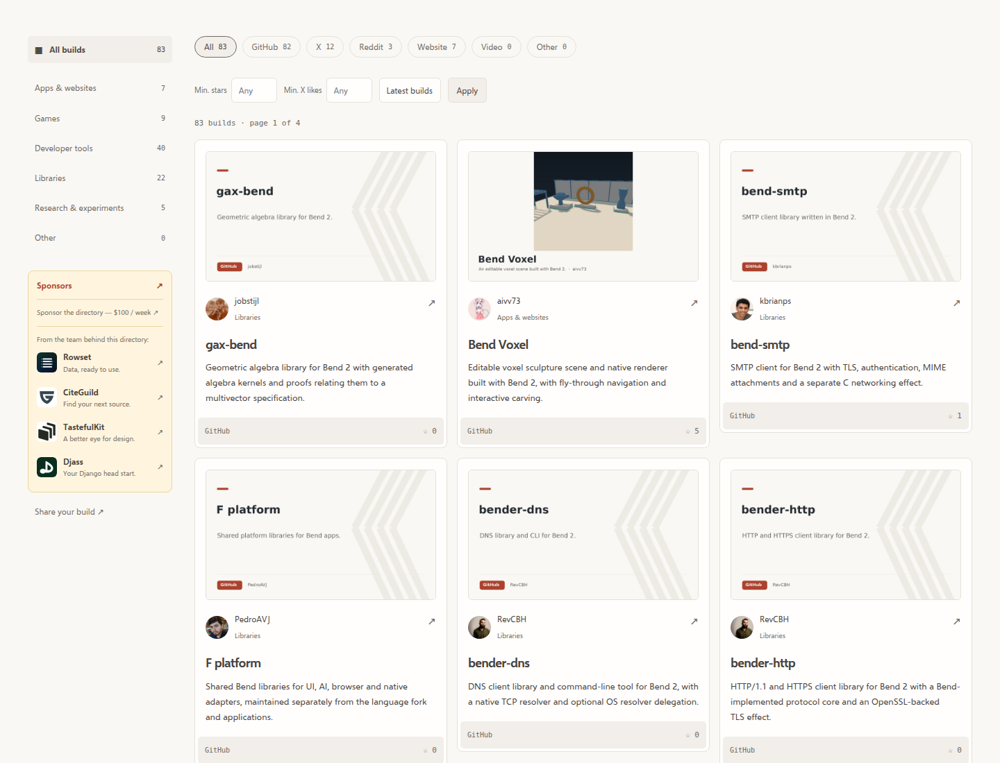
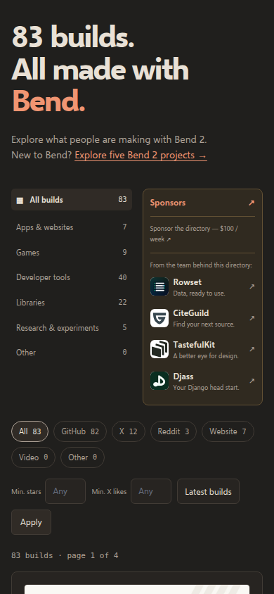

# Team sponsor assets

Verified against each official site on 2026-10-06. Local copies avoid third-party
image requests. Original artwork is unchanged; a white tile keeps dark marks
readable in both directory themes. Names beside the decorative images provide
accessible link labels. Paid sponsor records and Checkout are unchanged.

| Sponsor | Destination | Original asset |
| --- | --- | --- |
| Rowset | https://rowset.app/ | https://rowset.app/static/vendors/images/apple-touch-icon.fb590e5b3e37.png |
| CiteGuild | https://citeguild.dev/ | https://citeguild.dev/static/images/citeguild-logo.15f68d43f54d.svg |
| TastefulKit | https://tastefulkit.com/ | https://tastefulkit.com/static/brand/reference-stack.44996e6bb263.svg |
| Djass | https://djass.dev/ | https://djass.dev/static/vendors/images/logo.dbc6395ed338.svg |

Source assets live in `frontend/src/sponsors`; the asset build copies them into
`frontend/static/directory/sponsors` for Django static storage fingerprinting.

## Browser preview

These are browser-only previews of the exact assets, destinations and CSS applied
to the existing homepage DOM before deployment (not production verification).
Checked at 1440px and 390px in light/dark themes: all four images decoded and no
page or sponsor-row horizontal overflow.

